# SIGIS — Documentação Técnica

> Material de apoio para documentação acadêmica do projeto. Consolida contexto, arquitetura, modelo de dados e infraestrutura em um único documento, pensado para servir de "knowledge" em um Project do Claude.

## 1. Contexto e objetivo

O **SIGIS** (Sistema Integrado de Gestão de Impacto Social, Produção Social e Doações) é uma aplicação web voltada a organizações do terceiro setor que trabalham com **reaproveitamento de materiais**: recebem doações de materiais (tecidos, plásticos, móveis, eletrônicos), os transformam em novos produtos através de projetos sociais, e direcionam o resultado — produtos ou os próprios materiais — a instituições beneficiadas, emitindo termos de doação e registrando evidências fotográficas do processo.

O sistema cobre o ciclo completo:

```
Entrada de material → Estoque → Produção Social → Doação → Termo + Evidências
```

com um dashboard administrativo para acompanhar indicadores de impacto (peso reaproveitado, vidas impactadas, produção por projeto).

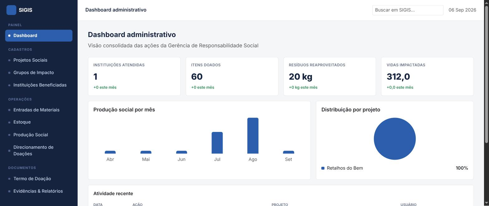

## 2. Arquitetura

**Stack:** PHP procedural (sem framework, sem Composer) + MySQL 8, front-end server-side renderizado com Bootstrap 5.

Não há camada de API nem SPA — cada tela é um script `.php` que renderiza o HTML diretamente, seguindo o padrão clássico de "1 arquivo por tela".

### Organização de diretórios

```
config/         Conexão com o banco (config/db.php) — lê credenciais de variáveis de ambiente
database/       Schema SQL completo (database/schema.sql)
includes/       bootstrap.php (sessão + conexão), functions.php (helpers), layout compartilhado
assets/         CSS
uploads/        Arquivos enviados pelos usuários (evidências fotográficas)
*.php           Uma página por funcionalidade
```

### Padrão de cada módulo

Cada funcionalidade (ex.: doações) segue o mesmo padrão de dois arquivos:

- `X.php` — tela de listagem/formulário (GET), renderiza HTML.
- `X_salvar.php` — endpoint de gravação (POST), processa o formulário, valida, grava no banco via PDO com *prepared statements*, e redireciona de volta com uma mensagem *flash*.

Autenticação é baseada em sessão PHP (`$_SESSION['user_id']`), verificada pela função `require_login()` (`includes/functions.php`) no topo de cada página protegida.

### Segurança aplicada

- Senhas armazenadas com hash (`password_hash`/bcrypt).
- Acesso ao banco via PDO com `ATTR_EMULATE_PREPARES => false` (queries parametrizadas de verdade, mitigando SQL injection).
- Saída HTML escapada via helper `e()` (`htmlspecialchars`), mitigando XSS.
- Upload de evidências valida `mime_content_type` contra uma lista branca de formatos de imagem antes de mover o arquivo.
- `.htaccess` bloqueia execução de PHP dentro de `uploads/` (evita upload de shell disfarçado de imagem sendo executado pelo servidor).

## 3. Modelo de dados

Diagrama entidade-relacionamento completo: **https://lucid.app/lucidchart/26fc2c9b-b127-4077-a1dd-d0a862714a0c/edit**

### Tabelas principais

| Tabela | Propósito |
|---|---|
| `usuarios` | Login e autoria de registros (quem lançou cada operação) |
| `grupos_impacto` | Categorias de material (Têxteis, Plásticos, Móveis e Madeira, Eletrônicos) |
| `itens` | Itens de material dentro de um grupo, com peso unitário e multiplicador de impacto |
| `projetos` | Projetos sociais mantidos pela organização |
| `instituicoes` | Instituições beneficiadas pelas doações |
| `estoque` | Saldo atual de cada item (1:1 com `itens`) |
| `entradas` | Registro de entrada de materiais (doação recebida) |
| `producoes` | Registro de produção: consome um item de estoque e gera um produto |
| `doacoes` / `doacao_itens` | Cabeçalho de doação + itens doados (relação 1:N) |
| `termos` | Termo de doação formal, vinculado 1:1 a uma doação |
| `evidencias` | Fotos/comprovantes vinculados a uma instituição |

### Relacionamentos-chave

- `itens.grupo_id → grupos_impacto.id`
- `estoque.item_id → itens.id` (1:1 — um saldo por item)
- `entradas.item_id → itens.id`, `entradas.projeto_id → projetos.id`
- `producoes.item_consumido_id → itens.id`, `producoes.projeto_id → projetos.id`
- `doacoes.instituicao_id → instituicoes.id`, `doacoes.projeto_id → projetos.id`
- `doacao_itens.doacao_id → doacoes.id`, `doacao_itens.item_id → itens.id`
- `termos.doacao_id → doacoes.id` (1:1)
- `evidencias.instituicao_id → instituicoes.id`
- Todas as tabelas de operação (`entradas`, `producoes`, `doacoes`) têm `criado_por → usuarios.id` para rastreabilidade de quem lançou o registro.

O **multiplicador de impacto** em `itens` é o mecanismo central de cálculo de indicadores: cada quantidade movimentada (entrada, produção, doação) é ponderada por esse valor para chegar a métricas como "peso equivalente de impacto social".

## 4. Infraestrutura (Docker)

A aplicação roda em dois containers orquestrados via `docker-compose.yml`:

- **`app`** — `php:8.2-apache`, extensões `pdo_mysql`/`mysqli`, serve o código em `http://localhost:8080`.
- **`db`** — `mysql:8.0`, inicializado automaticamente com `database/schema.sql` na primeira subida.

Credenciais e nome do banco vêm de variáveis de ambiente (`DB_HOST`, `DB_NAME`, `DB_USER`, `DB_PASS`, lidas em `config/db.php` via `getenv()`), configuradas em um `.env` local (não versionado). Os uploads de evidências são persistidos via bind mount (`./uploads`), sobrevivendo a rebuilds do container da aplicação; os dados do MySQL persistem em um volume nomeado (`db_data`).

Instruções completas de setup estão no `README.md` do repositório.

## 5. Telas do sistema

Capturas de tela de cada módulo, incluindo os modais de cadastro/lançamento.

### Projetos Sociais

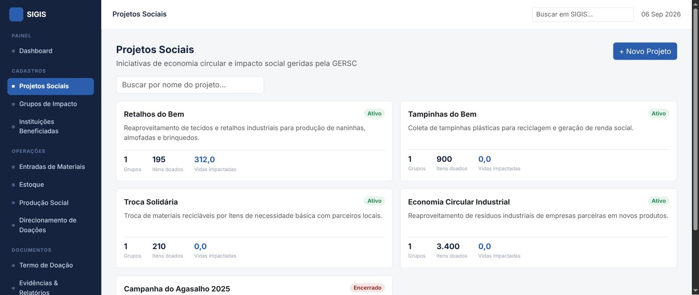
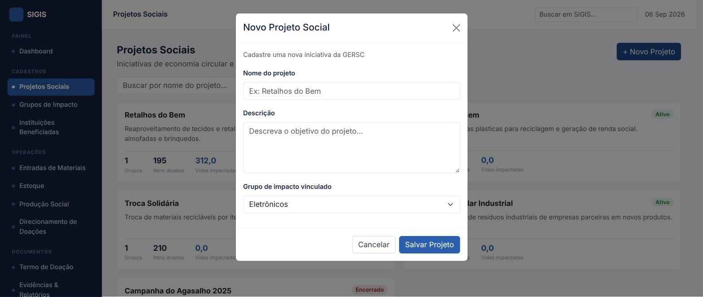

### Grupos de Impacto & Itens

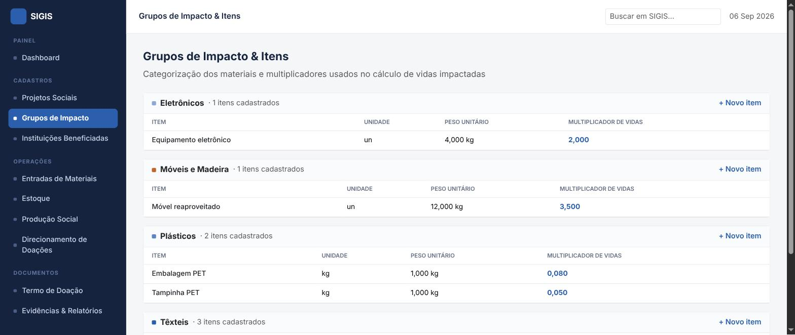
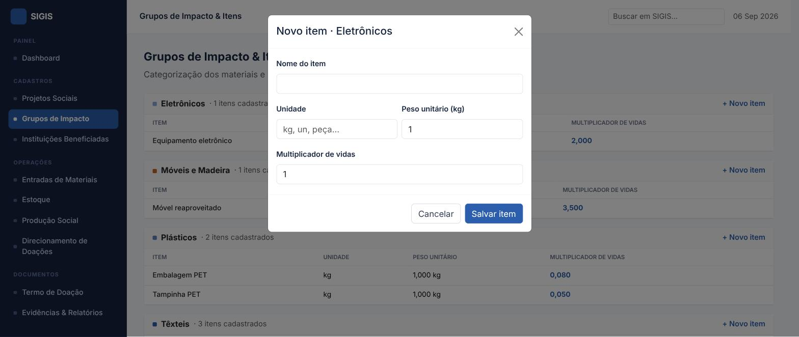

### Instituições Beneficiadas

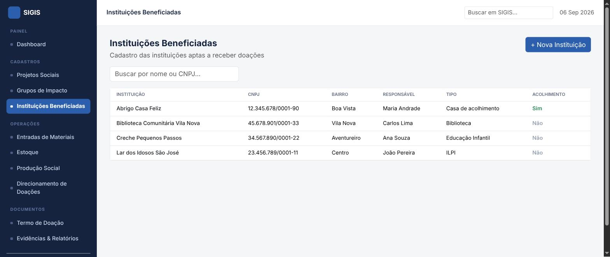
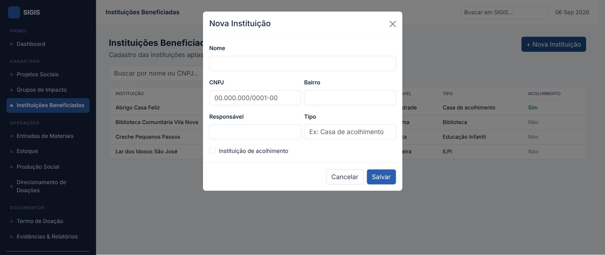

### Entradas de Materiais

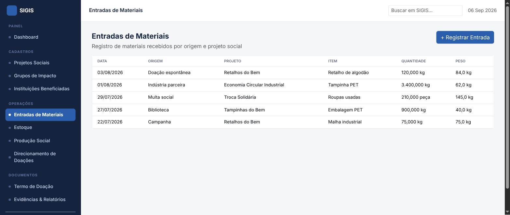
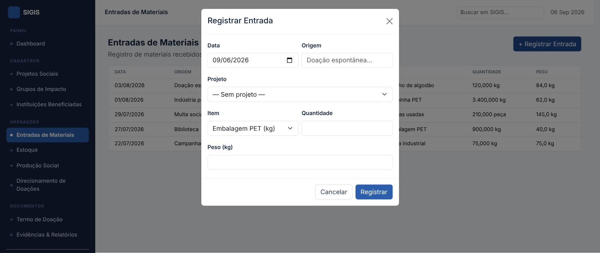

### Estoque de Itens

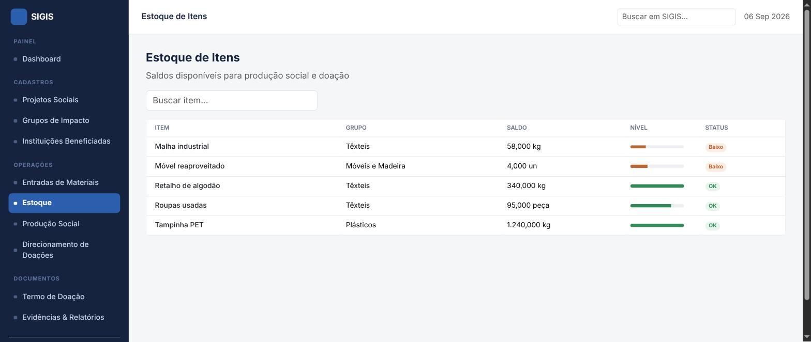

### Produção Social

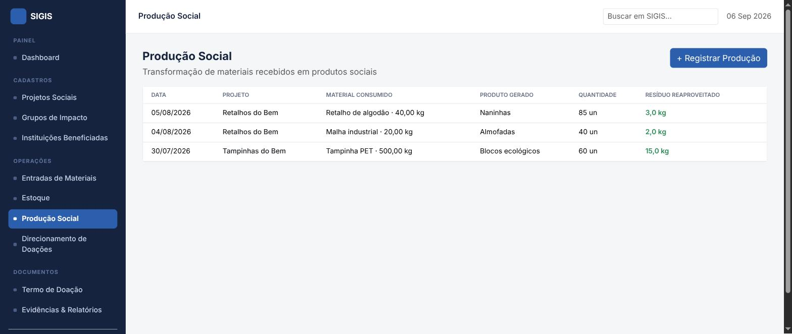
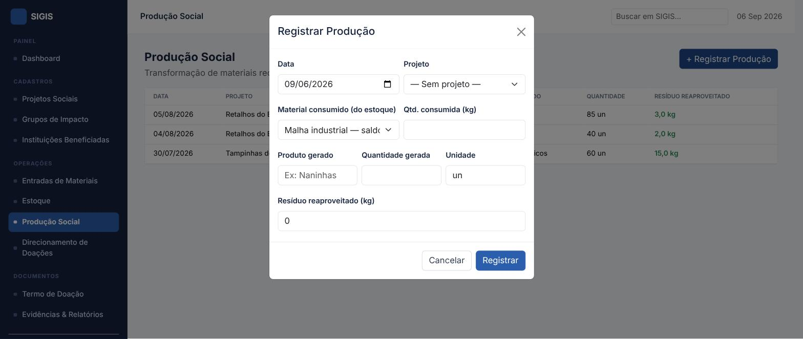

### Direcionamento de Doações

Fluxo em 3 passos (wizard): escolha da instituição, seleção de itens/quantidades e confirmação com geração do termo.


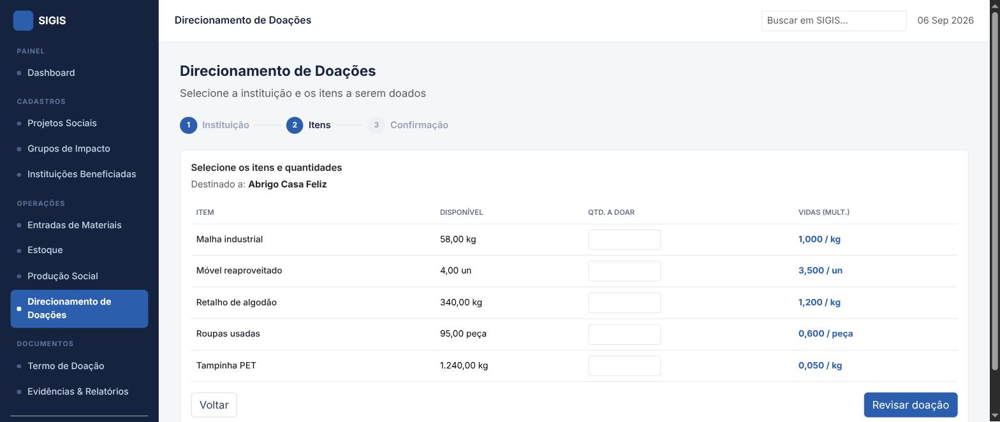
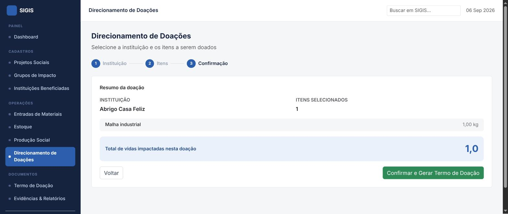

### Termo de Doação

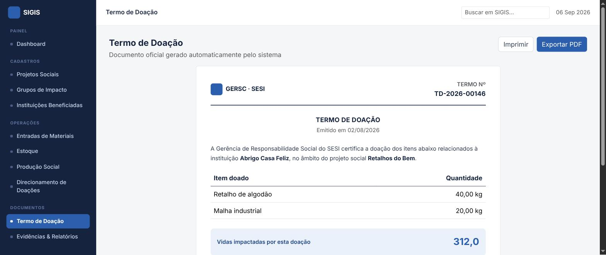

### Evidências & Relatórios

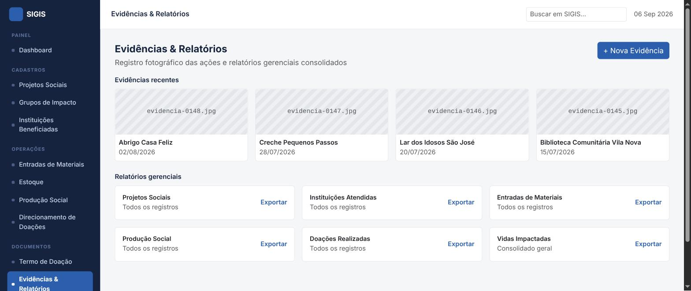
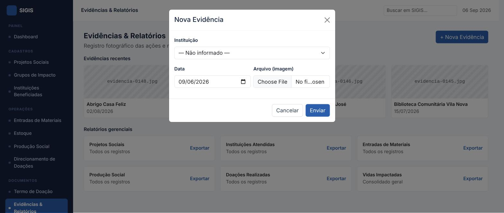

## 6. Login de demonstração

| Email | Senha |
|---|---|
| `admin@gersc.org.br` | `gersc123` |

> Nota para a documentação acadêmica: este é um usuário seed criado pelo `schema.sql` para fins de demonstração/desenvolvimento — não deve ser usado em um ambiente de produção real sem troca de senha.

## 7. Bug corrigido: acentuação exibida incorretamente

Durante a primeira rodada de capturas de tela foi observado que caracteres acentuados vindos do banco apareciam corrompidos na interface — ex.: "Eletrônicos" exibido como "Eletrônicos", "Móveis" como "Móveis", "Doação espontânea" como "Doação espontânea". Era um caso clássico de *mojibake* por double-encoding: confirmado via `HEX()` no MySQL que o dado gravado na tabela já estava corrompido (não era só um problema de exibição).

**Causa raiz:** o entrypoint oficial do MySQL importa o `database/schema.sql` executando `mysql --defaults-extra-file=... --protocol=socket ...`, sem `--default-character-set`. Sem esse flag, o cliente `mysql` usado no import cai num charset diferente de UTF-8, então cada caractere acentuado (2 bytes em UTF-8) é lido como 2 caracteres Latin-1 e regravado como UTF-8 — duplicando a codificação. Um `SET NAMES utf8mb4;` no topo do `schema.sql` **não resolveu**, porque esse comando afeta a interpretação do servidor, não o charset já aplicado pelo cliente na conexão inicial.

**Correção aplicada:** foi adicionado `database/mysql-charset.cnf`, montado em `/etc/mysql/conf.d/charset.cnf` no container do banco (ver `docker-compose.yml`), forçando `default-character-set=utf8mb4` no `[client]`/`[mysql]` e `character-set-server=utf8mb4` no `[mysqld]`. Isso garante que qualquer invocação do `mysql` dentro do container — incluindo a automática do entrypoint — use UTF-8 corretamente. As telas na seção 5 já refletem o texto corrigido.
